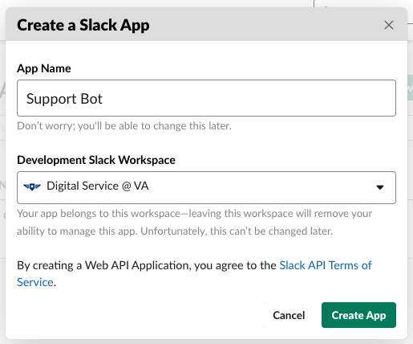

# README

## Editing Slack & GitHub templates

- views/issues/
- views/slack_thread/

## Installation

### Create Your Slack App (optional)

1. https://api.slack.com/apps
1. Click the button:

    
1. Fill and submit the form:

    
1. In your console, `bundle exec rails credentials:edit`, then update the secrets from the App Credentials section.

### Deploy to Heroku

[](https://heroku.com/deploy?template=https://github.com/department-of-veterans-affairs/va.gov-support-slackbot)

### Update Slack App Configuration

1. https://api.slack.com/apps
1. Click your new app
1. Click Event Subscriptions
    * Enable Events: On
    * Request URL: https://your-heroku-app.herokuapp.com/teams/create
    * Subscribe to bot events:
        * app_home_opened
        * app_mention
        * app_mentions:read
        * app_uninstalled
        * tokens_revoked
1. Click Oauth & Permissions
    * Click Add New Redirect URL, enter: https://your-heroku-app.herokuapp.com/teams/create

### Install to Slack Workspace

Then visit https://your-heroku-app.herokuapp.com/teams/new, and click the Add to Slack button.

## Troubleshooting

### Thread Details Are Not Updating

Using the Rails console (ex: `heroku run rails console`), note the last time the UpdateThreadsRepliesJob was enqueued:

```
irb> Que::Scheduler::VersionSupport.execute("select * from que_scheduler_audit_enqueued")
=> [{:scheduler_job_id=>43, :job_class=>"UpdateThreadsRepliesJob", :queue=>"default", :priority=>100, :args=>[], :job_id=>44, :run_at=>2020-09-28 19:00:02 +0000}, {:scheduler_job_id=>134, :job_class=>"UpdateThreadsRepliesJob", :queue=>"default", :priority=>100, :args=>[], :job_id=>135, :run_at=>2020-09-30 15:25:03 +0000}, {:scheduler_job_id=>140, :job_class=>"UpdateThreadsRepliesJob", :queue=>"default", :priority=>100, :args=>[], :job_id=>141, :run_at=>2020-09-30 15:30:00 +0000}]
```

Next, check the last time the Que Scheduler ran:

```
irb> Que::Scheduler::VersionSupport.execute("select * from que_scheduler_audit_enqueued")
=> [{:scheduler_job_id=>20, :executed_at=>2020-09-28 18:38:14 +0000}, {:scheduler_job_id=>21, :executed_at=>2020-09-28 18:39:04 +0000}, {:scheduler_job_id=>22, :executed_at=>2020-09-28 18:40:04 +0000}, {:scheduler_job_id=>23, :executed_at=>2020-09-28 18:41:00 +0000}]
```

Finally, check that the Que Scheduler job is enqueued:

```
irb> Que.job_stats
=> [{:job_class=>"Que::Scheduler::SchedulerJob", :count=>1, :count_working=>1, :count_errored=>0, :highest_error_count=>0, :oldest_run_at=>2020-09-30 15:26:00 +0000}]
```

If not, enqueue it:

```
irb> Que::Scheduler::SchedulerJob.enqueue
```

## Architecture

Slack events are POSTed to /slack_events
